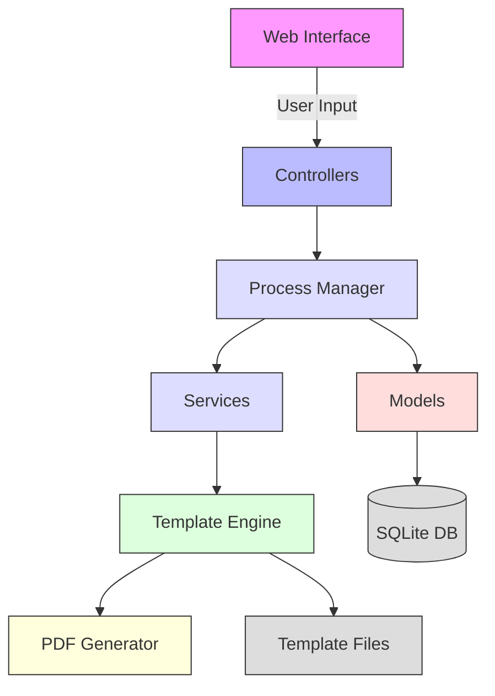
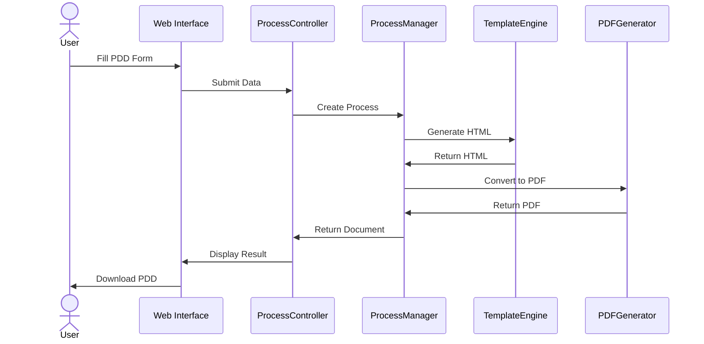
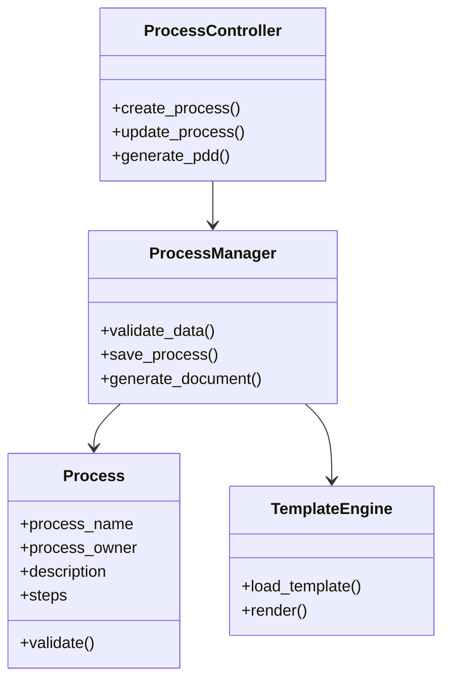
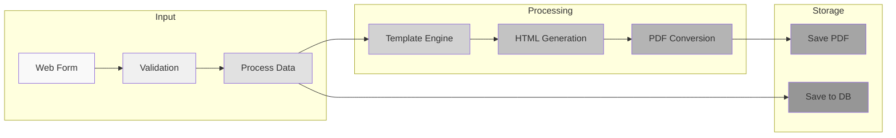
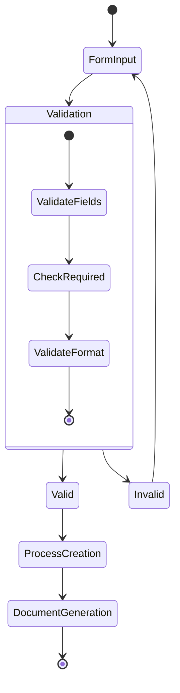

# System Diagrams

## Architecture Overview

```mermaid
graph TD
    A[Web Interface] -->|User Input| B[Controllers]
    B --> C[Process Manager]
    C --> D[Models]
    C --> E[Services]
    E --> F[Template Engine]
    F --> G[PDF Generator]
    D --> H[(SQLite DB)]
    F --> I[Template Files]
    
    style A fill:#f9f,stroke:#333
    style B fill:#bbf,stroke:#333
    style C fill:#ddf,stroke:#333
    style D fill:#fdd,stroke:#333
    style E fill:#ddf,stroke:#333
    style F fill:#dfd,stroke:#333
    style G fill:#ffd,stroke:#333
    style H fill:#ddd,stroke:#333
    style I fill:#ddd,stroke:#333
```

## Process Flow

```mermaid
sequenceDiagram
    actor User
    participant UI as Web Interface
    participant PC as ProcessController
    participant PM as ProcessManager
    participant TE as TemplateEngine
    participant PDF as PDFGenerator

    User->>UI: Fill PDD Form
    UI->>PC: Submit Data
    PC->>PM: Create Process
    PM->>TE: Generate HTML
    TE->>PM: Return HTML
    PM->>PDF: Convert to PDF
    PDF->>PM: Return PDF
    PM->>PC: Return Document
    PC->>UI: Display Result
    UI->>User: Download PDD
```

## Component Structure

```mermaid
classDiagram
    class ProcessController {
        +create_process()
        +update_process()
        +generate_pdd()
    }
    
    class ProcessManager {
        +validate_data()
        +save_process()
        +generate_document()
    }
    
    class Process {
        +process_name
        +process_owner
        +description
        +steps
        +validate()
    }
    
    class TemplateEngine {
        +load_template()
        +render()
    }
    
    ProcessController --> ProcessManager
    ProcessManager --> Process
    ProcessManager --> TemplateEngine
```

## Data Flow

```mermaid
flowchart LR
    subgraph Input
        A[Web Form] --> B[Validation]
        B --> C[Process Data]
    end
    
    subgraph Processing
        C --> D[Template Engine]
        D --> E[HTML Generation]
        E --> F[PDF Conversion]
    end
    
    subgraph Storage
        F --> G[Save PDF]
        C --> H[Save to DB]
    end
    
    style A fill:#f9f9f9
    style B fill:#f0f0f0
    style C fill:#e1e1e1
    style D fill:#d2d2d2
    style E fill:#c3c3c3
    style F fill:#b4b4b4
    style G fill:#a5a5a5
    style H fill:#969696
```

## Validation Process

```mermaid
stateDiagram-v2
    [*] --> FormInput
    FormInput --> Validation
    
    state Validation {
        [*] --> ValidateFields
        ValidateFields --> CheckRequired
        CheckRequired --> ValidateFormat
        ValidateFormat --> [*]
    }
    
    Validation --> Valid
    Validation --> Invalid
    
    Invalid --> FormInput
    Valid --> ProcessCreation
    ProcessCreation --> DocumentGeneration
    DocumentGeneration --> [*]
```
