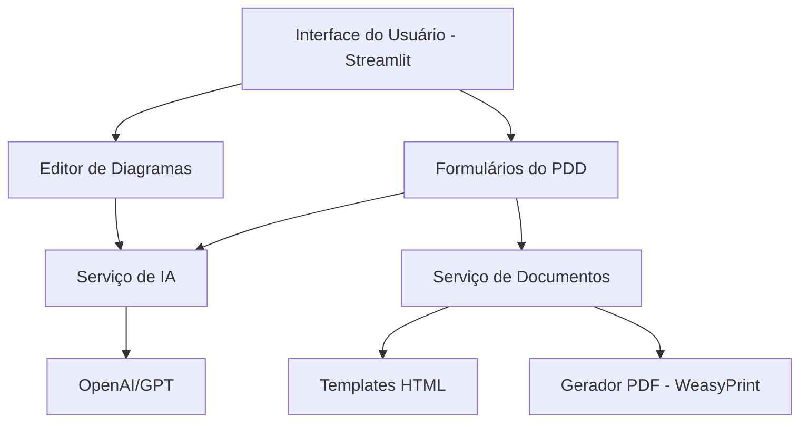
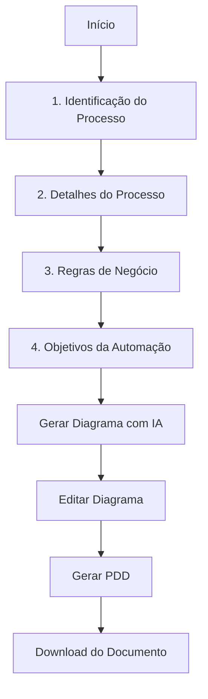
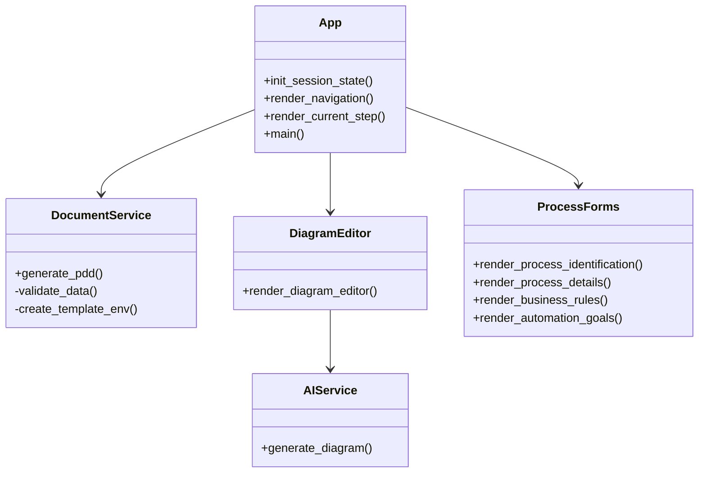
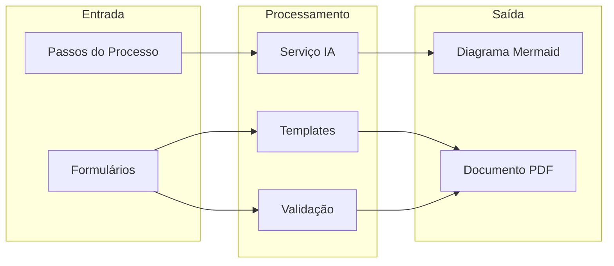
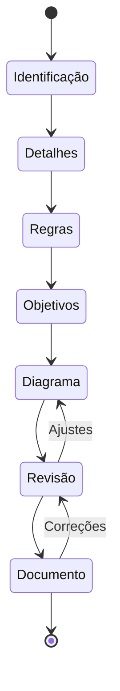

# Diagramas do Sistema

## 1. Visão Geral da Arquitetura

## 2. Fluxo do Usuário

## 3. Estrutura de Componentes

## 4. Fluxo de Dados

## 5. Ciclo de Vida do PDD

## Notas Técnicas

1. **Interface**: Streamlit para interface web interativa
2. **IA**: Integração com OpenAI/GPT para geração de diagramas
3. **Documentação**: 
   - Templates HTML com Jinja2
   - Geração PDF com WeasyPrint
4. **Armazenamento**: Sistema de arquivos local para PDDs gerados
5. **Visualização**: Mermaid.js para renderização de diagramas

## Próximas Melhorias

1. Persistência de dados
2. Exportação em diferentes formatos
3. Integração com sistemas externos
4. Versionamento de documentos
5. Customização de templates 